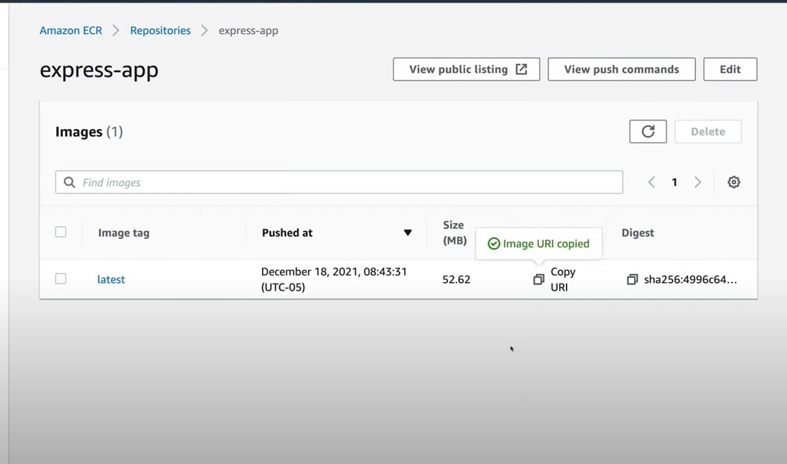
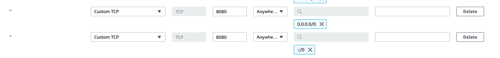

## Configure (if run local)

Paste your environment variables in the file .env

````bash
PORT=3000
AWS_ACCESS_KEY_ID=
AWS_SECRET_ACCESS_KEY=
S3_REGION=
S3_BUCKET=
ALLOWED_URL=
````

These key`AWS_ACCESS_KEY_ID` and `AWS_SECRET_ACCESS_KEY` can be found here:

1. Open the `AWS Console`
2. Click on your username near the top right and select `Security Credentials`
3. Find `Access Key` section
4. Click `Create Access Key`
5. Click Show User Security Credentials

Variables `S3_REGION` and `S3_BUCKET`:

1. Create S3 bucket by [instruction](https://docs.aws.amazon.com/AmazonS3/latest/userguide/creating-bucket.html)
2. Copy Region and bucket name which were specified during the Amazon S3 Bucket creation process

Variable `ALLOWED_URL` - it`s just the URL of the application that should have CORS access for the endpoints

#### Run App in docker

1. Run script `run-script.sh`
2. Open browser and follow this link `http://localhost:80`

## Instruction deploy app in amazon

FIRSTLY YOU MUST DELETE `.env` FILE

1. Follow the [link](https://docs.aws.amazon.com/cli/latest/userguide/getting-started-install.html) and install **AWS
   CLI**
2. In console or terminal depends on OS and enter:
    ````bash
      aws configure
    ````
3. You see something like this:
    ````bash
      AWS Access Key ID [None]: your AWS_ACCESS_KEY_ID
      AWS Secret Access Key [None]: your AWS_SECRET_ACCESS_KEY
      Default region name [None]: your region on aws
      Default output format [None]: just press enter
   ````
4. Fill all fields and close terminal

You can watch this [video](https://www.youtube.com/watch?v=YDNSItBN15w&t=1228s&ab_channel=LaithAcademy) or follow the
steps below.

1. Open [AWS website](https://aws.amazon.com/) and press button **Sign in to the console** and authorize
2. In Search field enter `ecs` and choose **Elastic Container Service**
   
3. In the left panel choose **Repositories**
4. Press the **Create Repository** button
5. Config repository:
    * In **General settings** section choose public for Visibility settings
    * In **Repository name** enter desired name (preferably with the same container name as in your local dev
      environment for consistency)
    * Press the **Create repository** button
6. Click on the repository that was just created
7. Press on the **View push commands** button
8. In the opened window you can see push commands. Use this command to authenticate and push an image to your
   repository. (Commands should be executed in the console by going to the root folder of the project)
9. Next step click **copy URI**
   
10. Repeat step 2
11. In the left panel choose **Clusters**
12. Change mode Experience. Just press on Toggle Switch
    
13. Press on the **Create Cluster** button
    * Select **EC2 Linux + Networking** and press **Next step**
    * In first section enter cluster name (for instance: file-picker)
    * In **Instance configuration** section find **EC2 instance type** and select `t3.micro` from dropdown list
    * In **Networking** section:
        * **VPC**: select an available vpc from dropdown list or create new
        * **Subnets**: select all subnet from dropdown list
        * **Auto assign public IP**: select `Enabled`
        * **Security group**: select security group or create new
    * In **Container instance IAM role** section select `ecsInstanceRole` from dropdown list
    * Press the **Create** button
14. In the left panel choose **Task Definitions**
    * Press on the **Create new Task Definition** button
    * Select **EC2** and press **Next Step**
    * Enter **Task definition name** (for instance: filePickerTaskDefinition)
    * Scroll down and find **Task size** section
    * Fill this fields **Task Memory(MiB)** (for instance: 900) and **Task CPU (unit)** (for instance: 1 vCPU)
    * In section **Container definitions** press on the **Add container** button
        * Enter **Container name** (for instance: filePickerImage)
        * In field **image** paste URI which you copy in 9 step
        * In section **Post mappings** add port mapping (Host port: `80` and Container port: `3000`)
        * Scroll down and find **Environment** section
        * In subsection **Environment variables** paste all variables which described in **Configuration (if run
          local)**
        * Scroll down and find **Storage And Logging**
        * In filed **Log configuration** check the box with name - *Auto-configure CloudWatch Logs* (it`s for logging in
          cloud watch)
        * Scroll down and press **add** and after that press **create**
15. In the left panel choose **Cluster** and select the created cluster
16. Choose **Task** tab and press **Run new Task**
    * **Launch Type**: choose `EC2`
    * **Task definition**: family - select task definition that was created in previous steps, Revision - just select
      last
    * Press on the **Create** button
17. In Search field enter `ec2` and choose **EC2**
    
18. In the left panel choose **Instance** and select the created instance (created instance name consist part with name
    cluster)
19. Go to the **Security** tab and press on the security group name (section Security groups)
    * In section **Inbound rules** press on the **Edit inbound rules**
    * Add the 2 rules that presented on image below:
      
    * Press **Save changes**
20. Repeat 18 step and on tab **Details** in section **Instance summary** you can find field **Public IPv4 DNS** - it is
    URL web-application

Also you can find logs application in cloud watch!!!

### How to use custom domain and https instead http

Just watch this [video](https://www.youtube.com/watch?v=whtEehGeYvU&ab_channel=Master2Teach) and follow step by step

